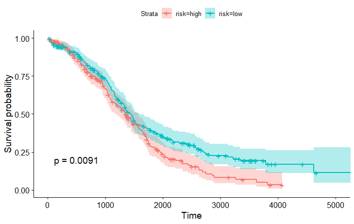
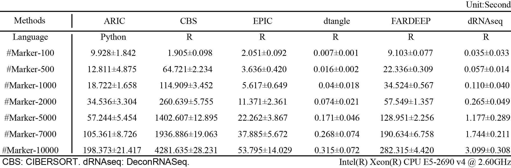

# ARIC

* [Section 1: Introduction](#section-1-introduction)
* [Section 2: Installation Tutorial](#section-2-installation-tutorial)
     * [Section 2.1: System requirement](#section-21-system-requirement)
     * [Section 2.2: Installation](#section-22-installation)
* [Section 3: A Quick Tutorial for Demo data Deconvolution](#section-3-a-quick-tutorial-for-demo-data-deconvolution)
     * [Section 3.1: Quick Start](#section-31-quick-start)
     * [Section 3.2: Function Introduction](#section-32-function-introduction)
* [Section 4: Applications on TCGA Ovarian Cancer](#section-4-applications-on-tcga-ovarian-cancer)
     * [Section 4.1: Deconvolution for All Patients](#section-41-deconvolution-for-all-patients)
     * [Section 4.2: Survival Analysis](#section-42-survival-analysis)
* [Section 5: Computational Efficiency Comparison](#section-5-computational-efficiency-comparison)
* [Citation](#citation)


## Section 1: Introduction

**<font color=red>ARIC</font>** is a bioinfomatics software for bulk gene expression and DNA methylation data deconvolution. ARIC utilizes a novel two-step marker selection strategy, including **component-wise condition number-based feature collinearity elimination** and **adaptive outlier markers removal**. This strategy can systematically obtain effective markers that ensure a robust and precise **weighted υ-SVR-based** rare proportion prediction.

## Section 2: Installation Tutorial

### Section 2.1: System requirement
ARIC is implemented using python and can be install in windows, UNIX/LINUX and MAC OS. ARIC requires python version >= 3 and all the dependent packages will be installed using pip.

### Section 2.2: Installation
ARIC can be installed from pypi by the following command. The source code can also be downloaded from pypi.

```Shell
pip install ARIC
```

## Section 3: A Quick Tutorial for Demo data Deconvolution

In this section, we will demonstrate how to perform bulk data deconvolution using the demo data.

### Section 3.1: Quick Start

We provide a small demo data [here](https://github.com/XWangLabTHU/ARIC/tree/main/data/demo). 
There are two main files in csv format. One saves the mixture bulk data and another saves external reference data. Just put the file path to the function "**ARIC**", and the program will do every thing.

```python
from ARIC import *

ARIC(mix_path="mix.csv", ref_path="ref.csv")
```

### Section 3.2: Function Introduction

The main function in ARIC is **decipher**.

```Python
ARIC(mix_path, ref_path, save_path=None, marker_path=None, 
     selected_marker=False, scale=0.1, delcol_factor=10,
     iter_num=10, confidence=0.75, w_thresh=10, 
     unknown=False, is_methylation=False)
```

+ **'mix_path'**: Path to mixture data, must be an csv file with colnames and rownames.
+ **'ref_path'**: Path to reference data, must be an csv file with colnames and rownames.
+ **'save_path'**: Where to save the deconvolution results. Default: mix_path_prefix_prop.csv.
+ **'marker_path'**: Path to the user specificed markers. Must be an csv file.
+ **'selected_marker'**: Output selected marker for every sample. Marker files will be saved in a folder named "sample_marker.csv".
+ **'scale'**: Used for controlling the convergence of SVR. A smaller value makes the convergence much faster. Default: 0.1.
+ **'delcol_factor'**: Used for controlling the extent of removing collinearity. Default: 10.
+ **'iter_num'**: Iterative numbers of outliers detection. Default: 10.
+ **'confidence'**: Ratio of remained markers in each outlier detection loop. Default: 0.75.
+ **'w_thresh'**: Threshold to cut the weights designer. Default: 10.
+ **'unknown'**: Whether to estimate unknown content proportion.
+ **'is_methylation'**: Whether the data type belongs to methylation data. If true, preliminary marker selection will be performed.


## Section 4: Applications on TCGA Ovarian Cancer

In this part, we will demonstrate how to use ARIC for ovarian cancer patients' classification. Users can follow the below instruction to reproduce the results in our article.

Ovarian cancer patients data with survival information can be downloaded from [LinkedOmics](http://linkedomics.org/login.php) directly. LM22 reference data can be downloaded from [CIBERTSORT](https://www.nature.com/articles/nmeth.3337). The survival information will be saved in file "Human__TCGA_OV__MS__Clinical__Clinical__01_28_2016__BI__Clinical__Firehose.tsi".

We provide the scaled data and survival information [here](https://github.com/XWangLabTHU/ARIC/tree/main/data/TCGA_OV). 

### Section 4.1: Deconvolution for All Patients

First, put "mix_scaled.csv" and "ref_scaled.csv" to your folder.

```Python
from ARIC import *

ARIC(mix_path="mix_scaled.csv", ref_path="ref_scaled.csv", save_path="ov_ARIC.csv",
     selected_marker=True)

```

Then, wait for the deconvolution done.

```Python
---------------------------------------------
--------------WELCOME TO ARIC----------------
---------------------------------------------
Data reading finished!
ARIC Engines Start, Please Wait......
100%|█████████████████████████████████████████████████████████████| 514/514 [01:14<00:00,  6.89it/s]
Deconvo Results Saving!
Finished!
```

There will be 2 main outputs. The first one is estimated proportion file named "ov_ARIC.csv". The second is a folder named "mix_scaled" (the same name with the input mixture file). All the markers selected by ARIC for each sample will be saved in folder "mix_scaled".

### Section 4.2: Survival Analysis

Then, we perform survival analysis based on R package "survival" and "survminer".

```R
library(survival)
library(survminer)
library(tidyr)
library(gridExtra)

# import survival information
sur_info <- read.table(file = "Human__TCGA_OV__MS__Clinical__Clinical__01_28_2016__BI__Clinical__Firehose.tsi", header = TRUE, row.names = 1)
tmp_rowname <- rownames(sur_info)

data <- read.csv(file = "ov_ARIC.csv", header = TRUE, row.names = 1)

selected_celltype <- c("T.cells.CD8", "T.cells.gamma.delta", 
                       "Macrophages.M1", "NK.cells.resting", 
                       "NK.cells.activated")

data <- data[selected_celltype, ]
data <- colSums(x = data)
prop_median <- median(data)

high_risk <- names(data)[which(data <= prop_median)]
low_risk <- names(data)[which(data > prop_median)]

label <- rep(x = "tumor", times = ncol(sur_info))
names(label) <- colnames(sur_info)
idx_high <- which(names(label) %in% high_risk)
label[idx_high] <- "high"
idx_low <- which(names(label) %in% low_risk)
label[idx_low] <- "low"

sur_info <- rbind(sur_info, label)
rownames(sur_info) <- c(tmp_rowname, "risk")

sur_info <- as.data.frame(t(sur_info[, which(colnames(sur_info) %in% names(data))]))

sur_info <- drop_na(data = sur_info, c("overall_survival", "status"))
sur_info <- transform(sur_info, overall_survival = as.numeric(overall_survival))
sur_info <- transform(sur_info, status = as.numeric(status))

fit <- survfit(Surv(overall_survival, status) ~ risk, data=sur_info)
ggsurvplot(fit, pval = TRUE, conf.int = TRUE)

res_cox <- coxph(Surv(overall_survival, status) ~ risk, data=sur_info)

summary(res_cox)$conf.int

```

Then, we can get the survival curve and hazard ratio like below.

```
        exp(coef) exp(-coef) lower .95 upper .95
risklow 0.7424766   1.346844  0.593249 0.9292413
```

<center>
    
    <br>
    <div style="color:orange; border-bottom: 1px solid #d9d9d9;
    display: inline-block;
    color: #999;
    padding: 2px;">ARIC Predicted OV patients' survival curve</div>
</center>

<br/>


## Section 5: Computational Efficiency Comparison


Computational efficiency is largely influenced by the number of markers. Therefore, we compared the computation time with both different methods and different marker numbers.

We generated in silico mixed gene expression data with different marker numbers (100, 500, 1000, 2000, 5000, 7000 and 10000). In order to get a reliable result, we generated 10 datasets and each dataset had 50 samples for each situation with different marker numbers. We compared the mean computation time for 50 samples and summarized the results in the foloowing table.

<center>
    
    <br>
    <div style="color:orange; border-bottom: 1px solid #d9d9d9;
    display: inline-block;
    color: #999;
    padding: 2px;">Computational Efficiency Comparison</div>
</center>

<br/>

ARIC needs to compute component-wise condition number after removing each collinearity marker. Therefore, the computational time will be longer than matrix operation-based methods like dtangle and deconRNAseq. The computational efficiencies of ARIC, EPIC and FARDEEP are at the same level. In addition, computational time of CIBERSORT growth drastically with the increase of marker number. Thus, we strongly recommended filtering low quality markers before deconvolution.

## Citation

Zhang, Wei, Hanwen Xu, Rong Qiao, Bixi Zhong, Xianglin Zhang, Jin Gu, Xuegong Zhang, Lei Wei, and Xiaowo Wang. "ARIC: accurate and robust inference of cell type proportions from bulk gene expression or DNA methylation data." Briefings in Bioinformatics 23, no. 1 (2022): bbab362.

